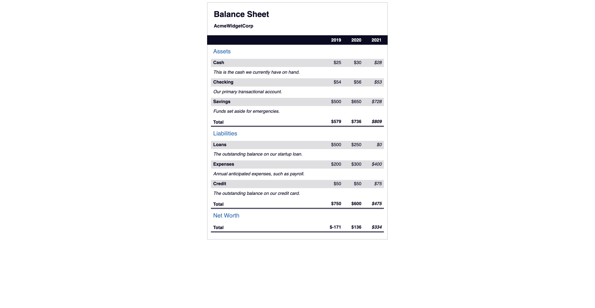

# Balance Sheet

A Balance Sheet webpage created using pseudo selectors to change the style of an element when hovering over it with  mouse, and trigger other events on the webpage.

## Tech Stack

- HTML
- CSS

## Screenshot


## Notes

### table
HTML tables use the caption element to describe what the table is about. The caption element should always be the first child of a table, but can be positioned with the caption-side CSS property.

The thead and tbody elements are used to indicate which portion of your table is the header, and which portion contains the primary data or content.

The tr element is used to indicate a table row. 

The td element indicates a data cell, while the th element indicates a header cell.


### clip
The CSS clip property is used to define the visible portions of an element. Set the span[class~="sr-only"] selector to have a clip property of rect(1px, 1px, 1px, 1px).

The clip-path property determines the shape the clip property should take. Set the clip-path property to the value of inset(50%), forming the clip-path into a rectangle within the element.


### :first-of-type
The :first-of-type pseudo-selector is used to target the first element that matches the selector.

```
h1 .flex span:first-of-type {
  font-size: 0.7em;
}
```


The :last-of-type pseudo-selector does the exact opposite - it targets the last element that matches the selector.

```
h1 .flex span:last-of-type {
  font-size: 1.2em;
}
```


### calc()
The calc() function is a CSS function that *allows you to calculate a value based on other values*. For example, you can use it to calculate the width of the viewport minus the margin of an element:

```CSS
.example {
  margin: 10px;
  width: calc(100% - 20px);
}
```


### :not()
The :not() pseudo-selector is used to *target all elements that do not match the selector*

```CSS
:not(p) {
  background: #ff0000;
}
```

### !important 
the !important keyword to ensure these properties are always applied, regardless of order or specificity.


###  [attribute="value"]

The [attribute="value"] selector targets any element that has an attribute with a specific value.


The key difference between *tr[class="total"] and tr.total is that the first will select tr elements where the only class is total. The second will select tr elements where the class includes total*.


### :nth-of-type()
The :nth-of-type() pseudo-selector is used to t*arget specific elements* based on their order among siblings of the same type

```CSS
tr.total td:nth-of-type(3) {
padding-right: 0.5rem;
}
```