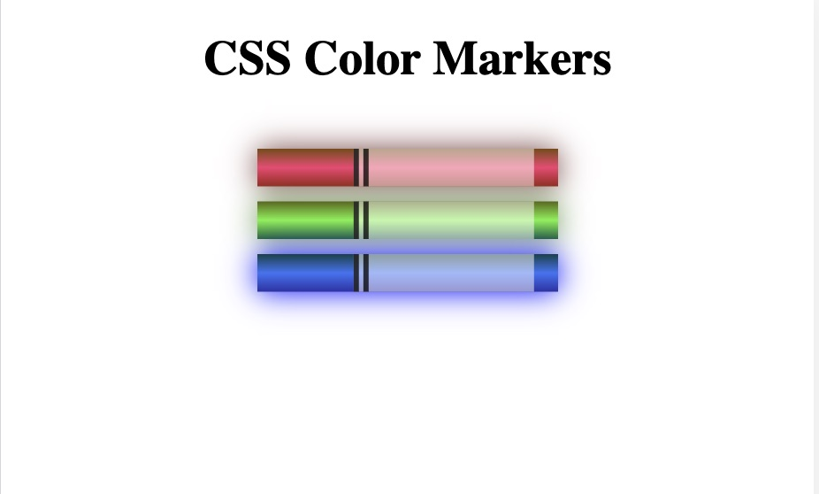

# Colored Markers

A Colored Markers webpage created using CSS in different ways to set color values and pair colors with each other.

## Tech Stack

- HTML 
- CSS

## Screenshot


## Notes

### RGB color
The CSS rgb function accepts values, or arguments, for red, green, and blue, and produces a color:

```CSS
rgb(red, green, blue);

rgb(255, 0, 0);
```

Each red, green, and blue value is a number from 0 to 255. 0 means that there's 0% of that color, and is black. 255 means that there's 100% of that color.

#### RGBA 

The rgba function works just like the rgb function, but takes one more number from 0 to 1.0 for the alpha channel:


```CSS
rgba(redValue, greenValue, blueValue, alphaValue);

rgba(255, 255, 255, 0.5);
```


### HEX color
Hex color values start with a # character and take six characters from 0-9 and A-F. The first pair of characters represent red, the second pair represent green, and the third pair represent blue:

With hex colors, 00 is 0% of that color, and FF is 100%. So #00FF00 translates to 0% red, 100% green, and 0% blue, and is the same as rgb(0, 255, 0).

```CSS
 #00FF00 /* pure green */
```

Use the values 3B for red, 7E for green, 20 for blue, and CC for the alpha channel.
```CSS
 #3B7E20CC
```

### HSL color
The HSL color model, or hue, saturation, and lightness, is another way to represent colors.

```
hsl(hue, saturation, lightness);

hsl(240, 100%, 50%);
```

The CSS hsl function accepts 3 values: a number from 0 to 360 for hue, a percentage from 0 to 100 for saturation, and a percentage from 0 to 100 for lightness.

### HSLA 
0.8 for the alpha channel

```CSS
 hsla(223, 59%, 31%, 0.8)
```


### Color gradient
the linear-gradient function actually creates an image element, and is usually paired with the background property which can accept an image as a value.

```CSS
background: linear-gradient(gradientDirection, color1, color2, ...);

background: linear-gradient(90deg, red, green);
```
gradientDirection is the direction of the line used for the transition. color1 and color2 are color arguments, which are the colors that will be used in the transition itself. These can be any type of color, including color keywords, hex, rgb, or hsl.

gradientDirection by default:  180 degree

### Color-stops
Color-stops allow you to fine-tune where colors are placed along the gradient line. They are a length unit like px or percentages that follow a color in the linear-gradient function.

For example, in this red-black gradient, the transition from red to black takes place at the 90% point along the gradient line, so red takes up most of the available space:

```CSS
linear-gradient(90deg, red 90%, black);
```

### Opacity
- control how opaque or transparent an element is.
- With the value 0, or 0%, the element will be completely transparent, and at 1.0, or 100%, the element will be completely opaque like it is by default.

```CSS
opacity: 0.5;
```

### Border

```CSS
border-left-width: 10px;
border-left-style: solid;
border-left-color: red;
```

the left border's width, style, and color at the same time.

```CSS
border-left: width style color;

border-left: 10px solid black;
```


### box-shadow
The box-shadow property lets you apply one or more shadows around an element. Here is basic syntax:

```CSS
box-shadow: offsetX offsetY color;

box-shadow: 5px 5px red;
```

- both offsetX and offsetY accept number values in px and other CSS units
- a positive offsetX value moves the shadow right and a negative value moves it left
- a positive offsetY value moves the shadow down and a negative value moves it up


-  if you want a value of zero (0) for any or both offsetX and offsetY, you don't need to add a unit.
```CSS
box-shadow: 0 0 red;
```
- #### blurRadius
  -  defaults to 0
  -  the higher the value of blurRadius, the greater the blurring effect is.
    ```CSS
    box-shadow: offsetX offsetY blurRadius color;

    box-shadow: 5px 5px 5px green;
    ```

- #### spreadRadius
  -  defaults to 0
  -   expand the shadow out further
   ```CSS
    box-shadow: offsetX offsetY blurRadius spreadRadius color;

    box-shadow: 0 0 0 5px blue;
    ```
