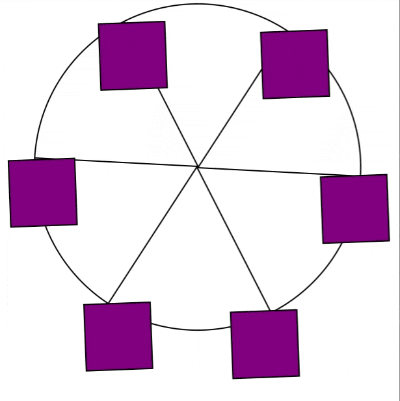

# Ferris wheel

A Ferris wheel created using CSS to animate elements, transform them, and adjust their speed.

## Tech Stack

- HTML
- CSS


## Screenshots


## Note
### @keyframes
The @keyframes at-rule is used to define the flow of a CSS animation. Within the @keyframes rule, you can create selectors for specific points in the animation sequence, such as 0% or 25%, or use from and to to define the start and end of the sequence.

@keyframes rules require a name to be assigned to them, which you use in other rules to reference. 
```CSS
 @keyframes {name} {
  0% { /* time frame */
     transform: rotate(0deg);  /* what to do */
   }
 }

```


### animation-name
The animation-name property is used to link a @keyframes rule to a CSS selector. The value of this property should match the name of the @keyframes rule

```CSS

.wheel {
  animation-name: wheel;
}

```

### animation-duration
The animation-duration property is used to set how long the animation should sequence to complete. The time should be specified in either seconds (s) or milliseconds (ms). 

```CSS
.wheel {
  animation-duration: 10s;
}
```

### animation-iteration-count
The animation-iteration-count property sets how many times your animation should repeat. This can be set to a number, or to infinite to indefinitely repeat the animation. Your Ferris wheel should never stop, so set the .wheel selector to have an animation-iteration-count of infinite.

```CSS
.wheel {
  animation-iteration-count: infinite;
}

```

### animation-timing-function
The animation-timing-function property sets how the animation should progress over time. There are a few different values for this property, but you want the Ferris wheel animation to run at the same rate from start to finish.

```CSS
.wheel {
  animation-timing-function: linear;
}

```


### animation
The animation-timing-function property sets how the animation should progress over time. There are a few different values for this property, but you want the Ferris wheel animation to run at the same rate from start to finish.

```CSS
animation: {animation-name}, {animation-duration}, {animation-timing-function}, {animation-iteration-count};

animation: wheel 10s linear infinite;
```

### transform-origin
The transform-origin CSS property sets the origin for an element's transformations.

```CSS
.cabin {
  /* x-offset | y-offset */
  transform-origin: 50% 0%;
}
```