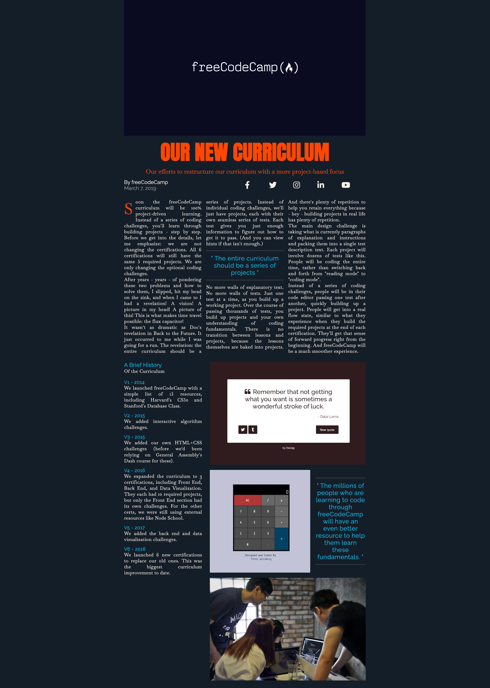

# Magazine

A magazine webpage created using CSS Grid.

## Tech Stack

- HTML
- CSS


## Screenshots
On PC:

On iPhone SE:


## Note
### loading
The loading attribute on an img element can be set to lazy to tell the browser not to fetch the image resource until it is needed (as in, when the user scrolls the image into view). As an additional benefit, lazy loaded elements will not load until the non-lazy elements are loaded - this means users with slow internet connections can view the content of your page without having to wait for the images to load.

```CSS


```


### noreferrer
The Referer HTTP header contains information about the address or URL of a page that a user might be visiting from. This information can be used in analytics to track how many users from your page visit freecodecamp.org, for example. *Setting the rel attribute to noreferrer omits this information from the HTTP request*. Give your a element a rel attribute set to noreferrer.

```CSS
<a href="https://freecodecamp.org" target="_blank" rel="noreferrer"
>freeCodeCamp</a
>
```


### CSS Grid
CSS Grid offers a two-dimensional grid-based layout, allowing you to center items horizontally and vertically while still retaining control to do things like overlap elements.

CSS Grid is similar to Flexbox in that it has a special property for both the parent and child elements.


```CSS
/* This will create three columns where the middle column is 94rem wide, and the first and last columns are both 1 fraction of the remaining space in the grid container.*/
grid-template-columns: 1fr 94rem 1fr;
```

#### grid-column
 The grid-column property is *shorthand for grid-column-start and grid-column-end*. The grid-column property tells the grid item which grid line to start and end at.


```CSS
/* This will tell the .heading element to start at grid line 2 and end at grid line 3 */
.heading {
  grid-column: 2 / 3;
}
```

The grid-column property determines which columns an element starts and ends at. *There may be times where you are unsure of how many columns your grid will have*, but you want an element to stop at the last column. To do this, you can use -1 for the end column.

```CSS
/* This will tell the element to span the full width of the grid. */
.hero {
  grid-column: 1 / -1;
}
```
The default settings for *CSS Grid will create additional rows as needed*, unlike Flexbox. Set the grid-template-columns property to repeat(5, 1fr) to arrange the icons in a single row.
```CSS
/* This will keep the elementsn on the same row*/
.social-icons {
   grid-template-columns: repeat(5, 1fr);
}
```
If you wanted to add more social icons, but keep them on the same row, you would need to update grid-template-columns to create additional columns. As an alternative, you can use the grid-auto-flow property.

This property takes either row or column as the first value, with an optional second value of dense. grid-auto-flow uses an auto-placement algorithm to adjust the grid layout. Setting it to column will tell the algorithm to create new columns for content as needed. The dense value allows the algorithm to backtrack and fill holes in the grid with smaller items, which can result in items appearing out of order.
```CSS
/* This will keep the elementsn on the same row*/
.social-icons {
  grid-template-columns: repeat(5, 1fr);
  grid-auto-flow: column;
}
```
### column-width
You can create columns within an element without using Grid by using the column-width property.
```CSS
/* This will keep the elementsn on the same row*/
.text {
  grid-column: 2 / 3;
  font-size: 1.8rem;
  letter-spacing: 0.6px;
  column-width: 25rem;
}
```

### minmax()
The *minmax function takes two arguments, the first being the minimum value and the second being the maximum*. These values could be a length, percentage, fr, or even a keyword like max-content

```CSS
grid-template-columns: minmax(2rem, 1fr) minmax(min-content, 94rem) minmax(2rem, 1fr);
```

### repeat()
The CSS repeat() function is used to repeat a value, rather than writing it out manually, and is helpful for grid layouts. For example, setting the grid-template-columns property to repeat(20, 200px) would create 20 columns each 200px wide.
```CSS
/* */
grid-template-columns: minmax(2rem, 1fr) minmax(min-content, 94re
```

### object-fit
The object-fit property *tells the browser how to position the element within its containe*r. In this case, cover will set the image to fill the container, cropping as needed to avoid changing the aspect ratio.
```CSS
object-fit: cover;
```


### justify


### :first-letter 
The ::first-letter pseudo-selector allows you to target the first letter in the text content of an element.
```CSS
.first-paragraph::first-letter {
  font-size: 6rem;
  color: orangered;
  float: left;
  margin-right: 1rem;
}
```


### gap
The gap property is a shorthand way to set the value of column-gap and row-gap at the same time. If given one value, it sets the column-gap and row-gap both to that value. If given two values, it sets the row-gap to the first value and the column-gap to the second.

```CSS
.image-wrapper {
  display: grid;
  grid-template-columns: 2fr 1fr;
  grid-template-rows: repeat(3, min-content);
  gap: 2rem; /* 2 rem gap for column-gap and row-gap */
}
```

### place-items
The place-items property can be used to set the align-items and justify-items values at the same time. The place-items property takes one or two values. If one value is provided, it is used for both the align-items and justify-items properties. If two values are provided, the first value is used for the align-items property and the second value is used for the justify-items property.

```CSS
.image-wrapper {
  display: grid;
  grid-template-columns: 2fr 1fr;
  grid-template-rows: repeat(3, min-content);
  gap: 2rem;
  place-items: center; /* set the align-items and justify-items values at the same time */
}
```