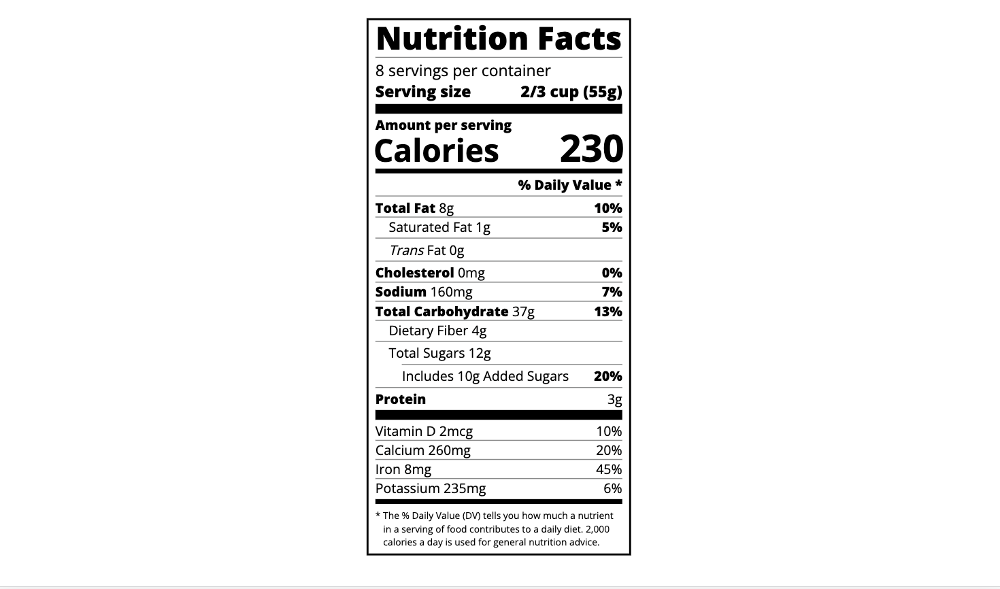

# Nutrition Label

A nutrition label webpage created using the use of typography.

## Tech Stack

- HTML
- CSS

## Screenshot


## Notes

### rem
The rem unit stands for root em, and is relative to *the font size of the html element*.


### :not

The :not pseudo-selector can be used to select all elements that do not match the given CSS rule.

```CSS
div:not(#example) {
  color: red;
}
```
The above selects all div elements without an id of example.