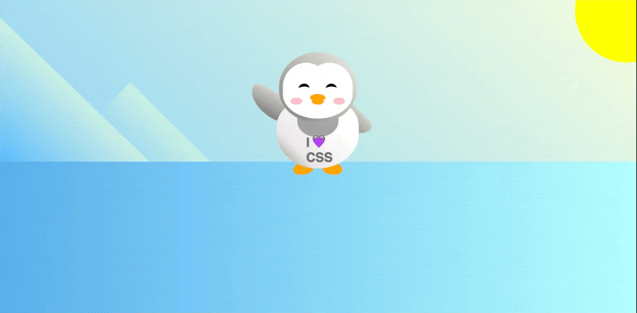

# Penguin

A penguin created using use CSS transforms to position and resize the parts of penguin, create a background, and animating.

## Tech Stack
- HTML
- CSS


## Screenshots


## Note
### skew
 the skew transform function, which takes two arguments. The first being an angle to shear the x-axis by, and the second being an angle to shear the y-axis by.

 
```CSS
  .left-mountain { /* step 16 */
    transform: skew(0deg, 44deg);
  }
```

### border-radius
 The border-radius CSS property rounds the corners of an element's outer border edge. You can set a single radius to make circular corners, or two radii to make elliptical corners.


```CSS
 /* top-left | top-right | bottom-right | bottom-left */
border-radius: 1px 0 3px 4px;
```


### scaleX()
The scaleX() CSS function defines a transformation that resizes an element along the x-axis (horizontally). Its result is a <transform-function> data type.

It modifies the abscissa (horizontal, x-coordinate) of each element point by a constant factor, except when the scale factor is 1, in which case the function is the identity transform. The scaling is not isotropic, and the angles of the element are generally not conserved, except for multiples of 90 degrees. scaleX(-1) defines an axial symmetry, with a vertical axis passing through the origin (as specified by the transform-origin property).

```CSS
.arm.left {
   /* an axial symmetry */
  transform: rotate(130deg) scaleX(-1);

}
```