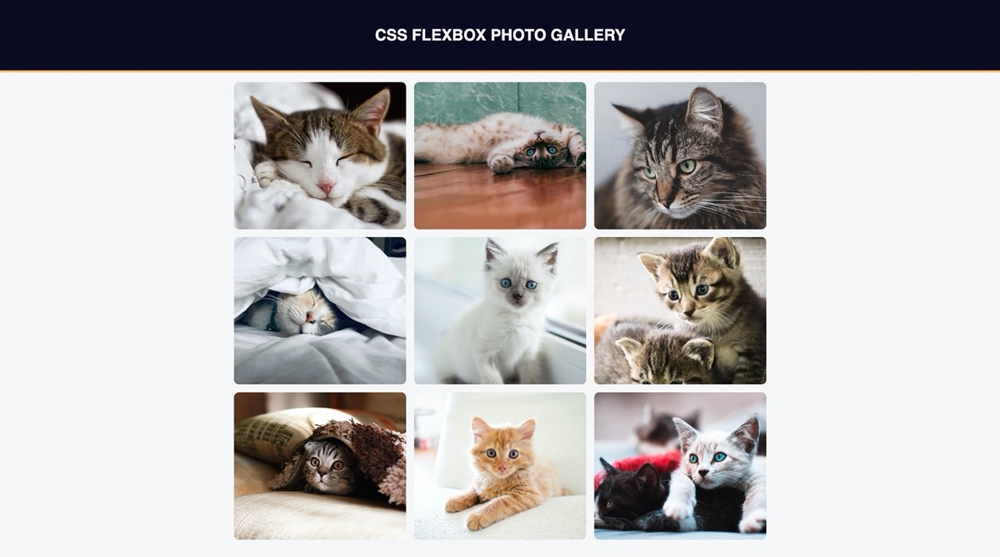

# Photo Gallery

A responsive photo gallery webpage created using Flexbox.

## Tech Stack

- HTML 
- CSS

## Screenshot


## Notes

### box-sizing
The box-sizing property is used to set this behavior. By default, the *content-box model* is used. With this model, when an element has a specific width, that *width is calculated based only on the element's content*. Padding and border values get added to the total width, so the element grows to accommodate these values.

The *border-box* sizing model does the opposite of content-box. *The total width of the element, including padding and border, will be the explicit width set*. The content of the element will shrink to make room for the padding and border.

```CSS
box-sizing: content-box; /* default */
box-sizing: border-box;
```

### flex
Flexbox is a *one-dimensional* CSS layout that can control the way items are spaced out and aligned within a container.

Flexbox has a main and cross axis. The main axis is defined by the flex-direction property, which has four possible values:

  - row (default): horizontal axis with flex items from left to right
  - row-reverse: horizontal axis with flex items from right to left
  - column: vertical axis with flex items from top to bottom
  - column-reverse: vertical axis with flex items from bottom to top

Note: The axes and directions will be different depending on the text direction. The values shown are for a left-to-right text direction.


#### flex-wrap
The flex-wrap property determines *how your flex items behave when the flex container is too small*. Setting it to wrap will allow the items to wrap to the next row or column. nowrap (default) will prevent your items from wrapping and shrink them if needed.

#### justify-content 
The justify-content property determines *how the items inside a flex container are positioned along the main axis*, affecting their position and the space around them.


#### align-items
The align-items property *positions the flex content along the cross axis*. In this case, with your flex-direction set to row, your cross axis would be vertical.


### object-fit
Notice how some of your images have become distorted. This is because the images have different aspect ratios. Rather than setting each aspect ratio individually, you can use the object-fit property to determine how images should behave.

e.g *cover*:  will tell the image to fill the img container while maintaining aspect ratio, resulting in cropping to fit.

```CSS
object-fit: cover;
```
### gap
The gap CSS shorthand property sets the gaps, also known as *gutters, between rows and columns*. The gap property and its row-gap and column-gap sub-properties provide this functionality for flex, grid, and multi-column layout. You apply the property to the container element.


### ::after
The ::after pseudo-element *creates an element that is the last child of the selected element*. You can use it to add an empty element after the last image. If you give it the same width as the images it will push the last image to the left when the gallery is in a two-column layout. Right now, it is in the center because you set justify-content: center on the flex container.

```CSS
.container::after {
  content: "";
  width: 860px;
}
```