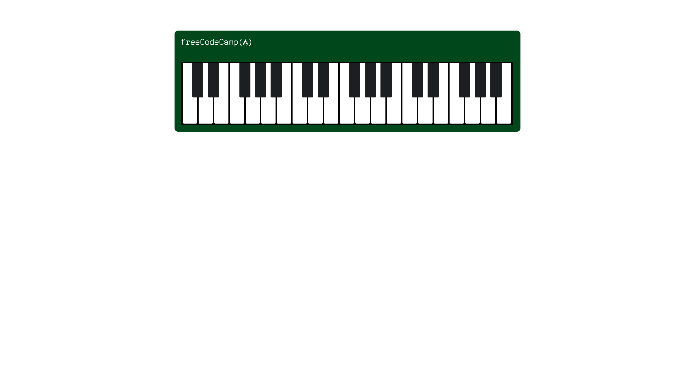
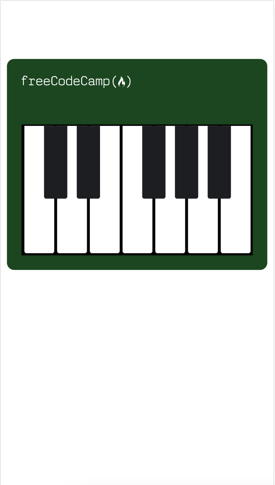

# Piano

A Paino webpage created using CSS and Responsive Design to make it adapdted to different-sized screens .

## Tech Stack

- HTML
- CSS


## Screenshot

On iPhone SE:


## Note

### inherit
inherit will tell the targeted elements to use the same value as the parent element.

```CSS
html {
  box-sizing: border-box;
}

body {
  box-sizing: inherit; /* border-box */
}
```


### ::before & ::after 

The ::before selector *creates a pseudo-element which is the first child of the selected element*, while the ::after selector *creates a pseudo-element which is the last child of the selected element*. These pseudo-elements are often used to create cosmetic content.


```CSS
.key.black--key::after {
  content: "";
}
```
#### content
The content property is used to set or override the content of the element. By default, the pseudo-elements created by the ::before and ::after pseudo-selectors are empty, and the elements will not be rendered to the page. *Setting the content property to an empty string "" will ensure the element is rendered to the page while still being empty*.


### media query
The @media at-rule, also known as a media query, is used to *conditionally apply CSS*. Media queries are commonly used to apply CSS based on the viewport width using the max-width and min-width properties.

In the below example the padding is applied to the .card class when the viewport is 960px wide and below.

```CSS
@media (max-width: 960px) {
  .card {
    padding: 2rem;
  }
}
```
#### Logical operators
Logical operators can be used to construct more complex media queries. The and logical operator is used to query two media conditions.

For example, a media query that targets a display width between 500px and 1000px would be:

```CSS
@media (min-width: 500px) and (max-width: 1000px){

}
```