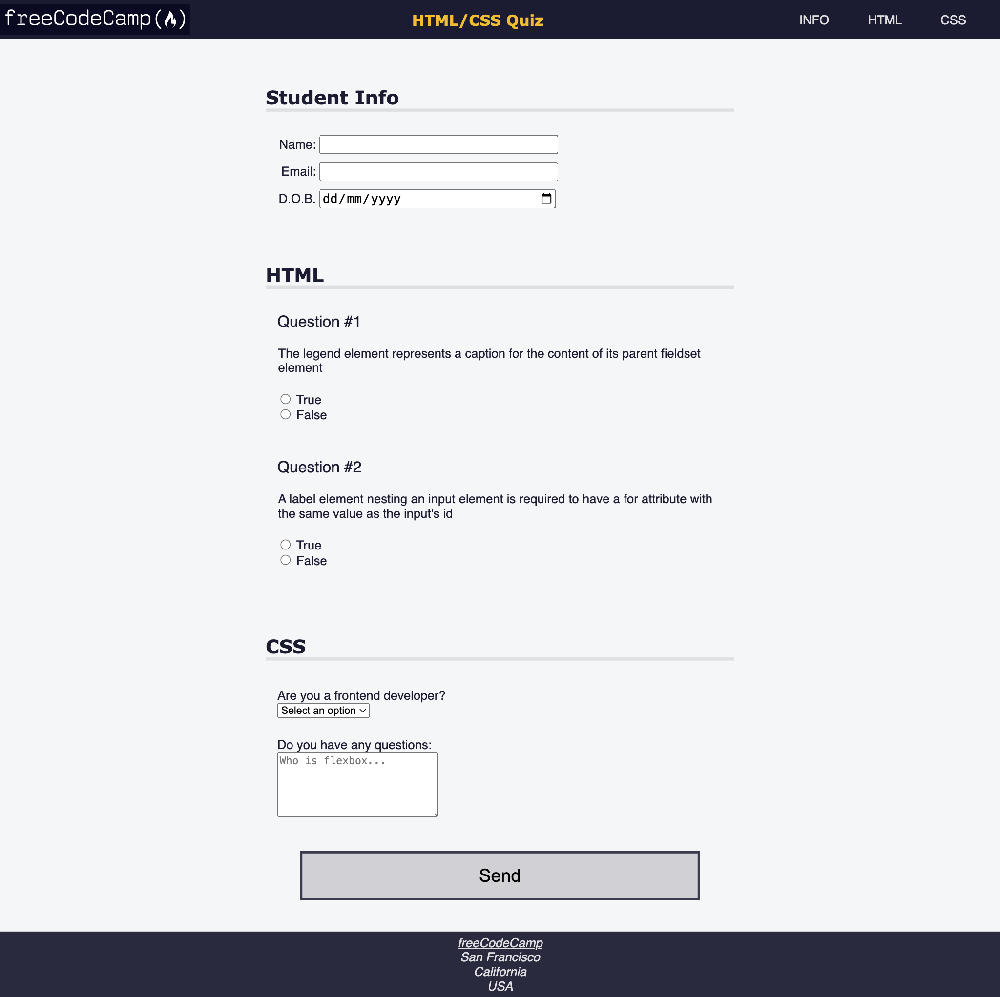

# Quiz

A quiz webpage created using different accessibility tools such as keyboard shortcuts, ARIA attribute etc.

## Tech Stack

- HTML
- CSS

## Screenshot


## Notes


### max function 
CSS has a max function which *returns the largest of a set of comma-separated values*.

For example:
```CSS
img {
  width: max(250px, 25vw);
}
```
In this example, img elements will have a minimum width of 250px. And as the viewport grows, the image will grow accordingly to be 25 percent of the viewport width

### meta description 
- provides a brief summary of a web page


```CSS
 <meta
      name="description"
      content="freeCodeCamp Accessibility Quiz practice project"
 />
```

### role
To increase the page accessibility, the role attribute can be used to *indicate the purpose behind an element on the page to assistive technologies*. The role attribute is a part of the Web Accessibility Initiative (WAI), and accepts preset values.


###  aria-labelledby

- aria-labelledby can be used to reference another element to define its accessible name, when an element's accessible name needs to use content from elsewhere in the DOM. 

-  *helps screen reader users understand the purpose.


- aria-label can be used in cases where text that could label the element is not visible. If there is *visible text that labels an element, use aria-labelledby* instead

```CSS
 <section role="region" aria-labelledby="html-questions">
 ```


### ::before 
::before creates a pseudo-element that is the first child of the selected element. It is often used to add cosmetic content to an element with the content property. It is inline by default.

```CSS
q::before {
  content: "«";
  color: blue;
}
```

### clip
The clip CSS property *defines a visible portion* of an element. The clip property applies only to absolutely positioned elements — that is, elements with position:absolute or position:fixed.

```CSS
.sr-only {
  position: absolute;
  width: 1px;
  height: 1px;
  padding: 0;
  margin: -1px;
  overflow: hidden;
  clip: rect(0, 0, 0, 0); /* unvisible */
  white-space: nowrap;
  border: 0;
}

```

### color contrast ratio
According to the Web Content Accessibility Guidelines (WCAG) 2.0 we must ensure that a contrast ratio of *at least 4.5:1* exists between a background and its text (or images of text). This applies for text that is less than 24px (if not bold) and less than 19px (if bold). For larger text a ratio of 3:1 is sufficient. Those are the minimum numbers to meet level AA criteria. *To pass level AAA the minimum ratio for normal text is 7:1 and 4.5:1 for bold text*.

### scroll-behavior
Clicking on the navigation links should jump the viewport to the relevant section. However, this jumping can be disorienting for some users.

To fix this, select all elements, and set the scroll-behavior to smooth.

```CSS
* {
    scroll-behavior: smooth;
}
```

### prefers-reduced-motion

The prefers-reduced-motion CSS media feature is used to detect if a user has enabled a setting on their device to minimize the amount of non-essential motion

no-preference:
Indicates that a user has made no preference known on the device. This keyword value evaluates as false.

```CSS
@media (prefers-reduced-motion: no-preference) {
  * {
    scroll-behavior: smooth;
  }
}
```

### keyboard shortcuts
The navigation accessibility can be improved by providing keyboard shortcuts.

The accesskey attribute accepts a space-separated list of access keys. For example:
```CSS
<button type="submit" accesskey="s">Submit</button>
```

Give each of the navigation links a single-letter access key.

