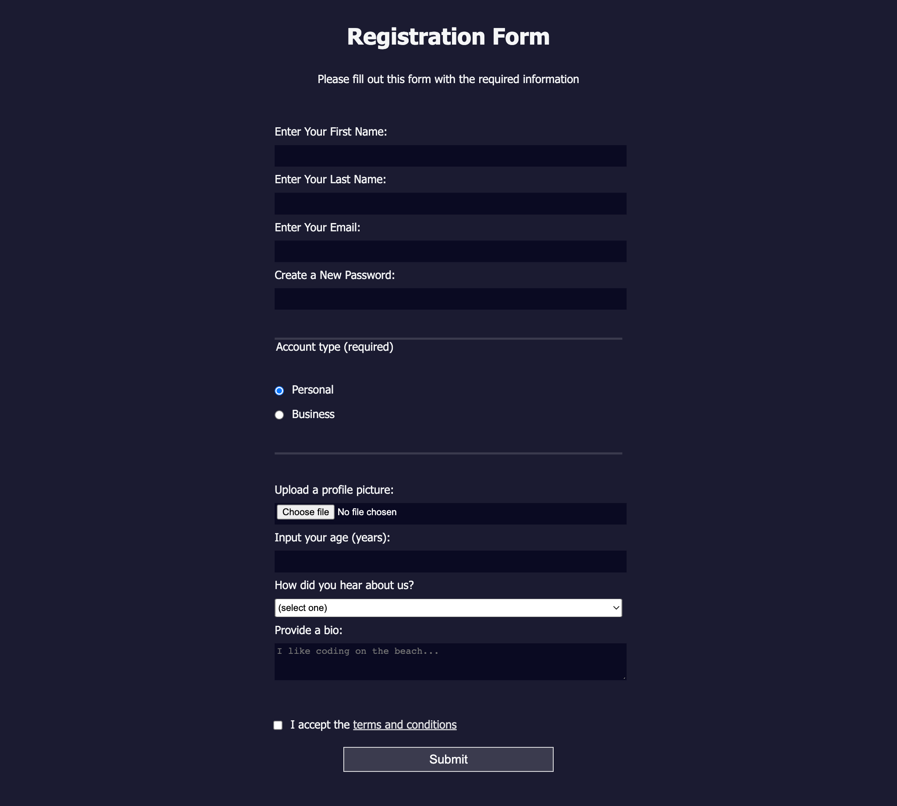

# Registration Form

A Registration Form webpage created using CSS in different ways to set color values and pair colors with each other.

## Tech Stack

- HTML
- CSS

## Screenshot


## Notes

### form

#### method attribute 
method attribute specifies how to send form-data to the URL specified in the action attribute. The form-data can be sent via a GET request as URL parameters (with method="get") or via a POST request as data in the request body (with method="post").


```CSS
 <form method="post" action='https://register-demo.freecodecamp.org'>

```
#### legend
provide context of what is needed 
```CSS
<fieldset>
  <legend>Account type (required)</legend> 
</fieldset>
```
### vh
The vh unit stands for viewport height, and is relative to 1% of the height of the viewport.

### label
- inline by default
- displayed side by side on the same line, making their text hard to read

### rem
The rem unit stands for root em, and is relative to the font size of the html element.

### input

```CSS
<input />
```


### last-of-type
select the last element of a specific type using the last-of-type CSS pseudo-class, like this:

```CSS
p:last-of-type { }
```


### attribute selector
selects an element based on the given attribute value
```CSS
input[name="password"]
```