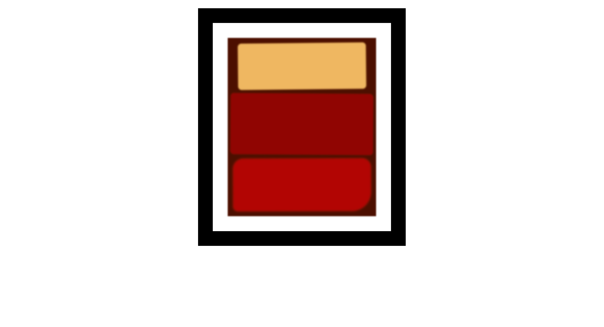

# Rothko Painting

A Rothko-style rectangular art pieces webpage created using Box Model.


## Tech Stack

- HTML
- CSS

## Screenshot



## Notes

### box model
In the CSS box model, every HTML element is treated as a box with four areas.

The content is surrounded by a space called padding, similar to how bubble wrap separates an item from the box around it.

Margin is the area outside of the box, and can be used to control the space between other boxes or elements.


### border-radius
The border-radius property accepts up to four values to round the top-left, top-right, bottom-right, and bottom-left corners.

```CSS
border-radius:   top-left top-right bottom-right bottom-left;

/* top-left-and-bottom-right | top-right-and-bottom-left */
border-radius: 10px 5%;
```


